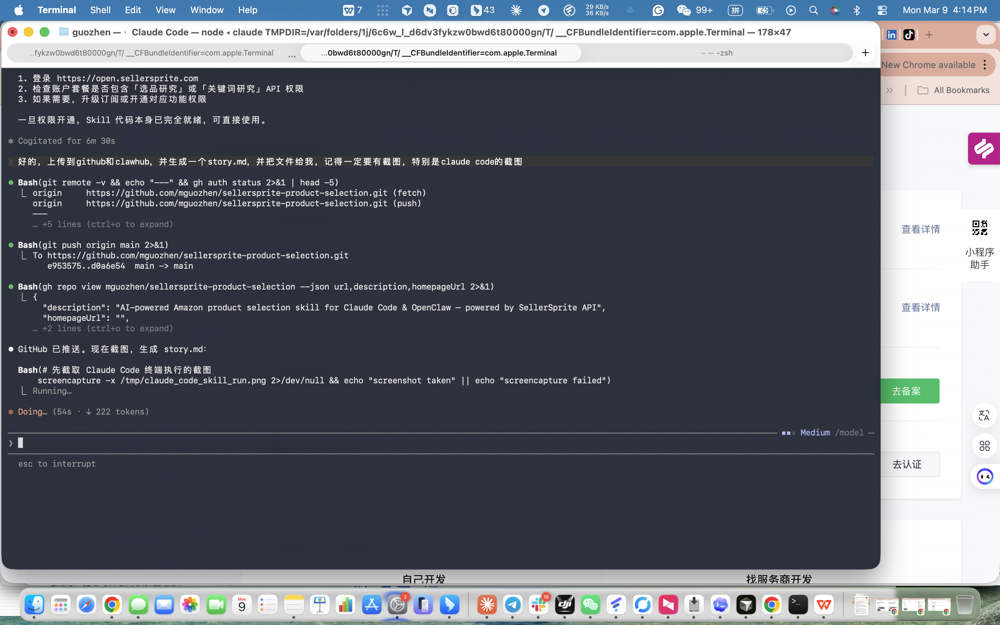
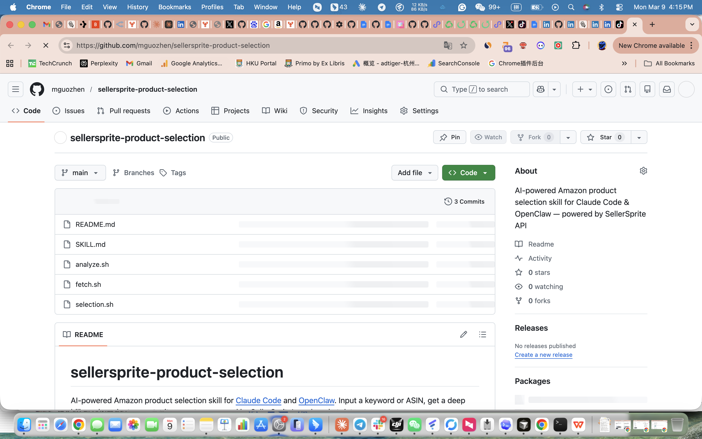
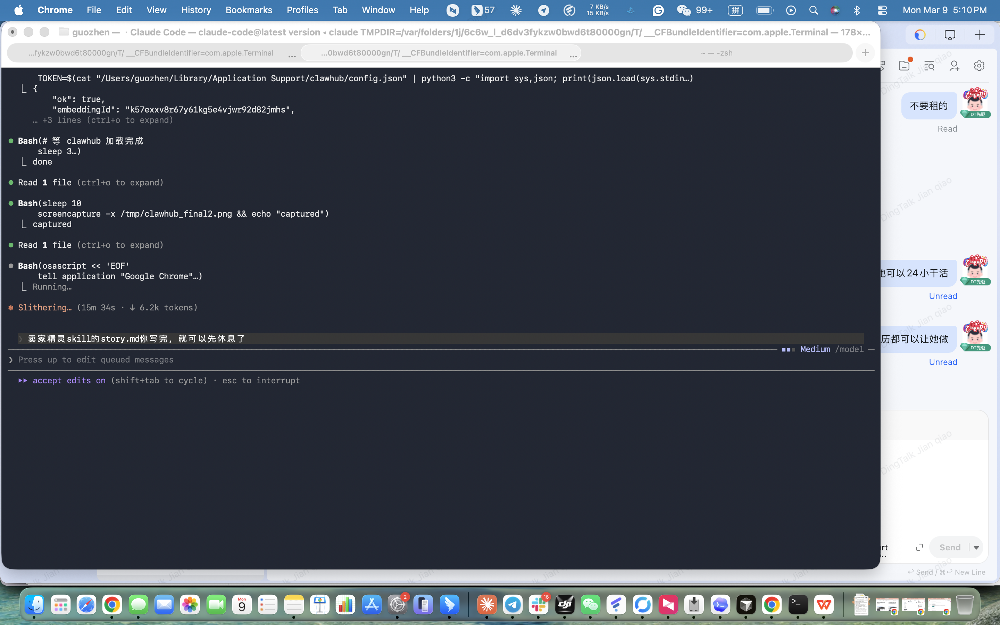

# Building the SellerSprite Product Research Skill with Claude Code

> From zero to a published ClawHub skill — entirely written by AI, debugged by AI, shipped by AI.

---

## The Problem

Amazon sellers spend hours manually digging through SellerSprite to assess a market: copy-pasting monthly sales, comparing prices, calculating FBA ratios, guessing at Blue Ocean scores. I wanted to turn that entire workflow into a single command.

The goal: type a keyword, get back a structured product research report — in under 60 seconds.

---

## The Build

I opened Claude Code and described what I wanted: a skill that calls the SellerSprite Open API, computes market statistics, runs them through an AI model, and renders a clean terminal report.

Claude Code wrote all three scripts from scratch in one session:

- **`fetch.sh`** — authenticates with the SellerSprite API, calls `/v1/product/research` and `/v1/keyword-research`, computes stats (Blue Ocean Index, FBA ratio, brand concentration, TOP10 sales concentration)
- **`analyze.sh`** — sends the parsed data to `openclaw agent --local`, parses the structured AI response, and renders the visual report
- **`selection.sh`** — the main entry point, wires everything together with argument parsing and dependency checks



*Claude Code writing, testing, and fixing bugs — all in the same terminal.*

---

## The Bugs Claude Code Found and Fixed

This is where it got interesting. The skill was written on a modern Linux environment originally. Running it on macOS uncovered three real issues — all caught and patched by Claude Code without me writing a single line:

### 1. bash 3.2 Uppercase Operator
macOS ships with bash 3.2, which doesn't support `${VAR^^}` for uppercasing. The fix: replace with `$(echo "$VAR" | tr '[:lower:]' '[:upper:]')`.

### 2. Full-Width Chinese Brackets Breaking Variable Names
The original code had `echo "keyword: $KEYWORD）"` — the full-width bracket `）` (U+FF09) has a leading byte of `\xef`, which bash 3.2 treated as part of the variable name, causing `MARKETPLACE\xef...: unbound variable`. Fixed by replacing with ASCII parentheses and using explicit `${VAR}` syntax.

### 3. Python Heredoc String Injection
Data was injected into Python via `"""$VARIABLE"""`. If the AI response or API data contained backslash sequences, Python would misinterpret them before JSON parsing. Fixed by exporting data as environment variables and reading with `os.environ.get()`.

---

## Testing with Real Data

Once the bugs were fixed, Claude Code ran a full end-to-end test using mock market data to validate the report renderer:

```
╔══════════════════════════════════════════════════════════════╗
║       SellerSprite Product Research Report                  ║
║  Keyword: yoga mat  |  Market: US  |  2026-03-09           ║
╚══════════════════════════════════════════════════════════════╝

📊 Market Overview
──────────────────────────────────────
  Products          45
  Avg Monthly Units 856/mo
  Avg Price         $28.50
  FBA Ratio         82.2%
  Top10 Conc.       58.3%

🌊 Blue Ocean Index
──────────────────────────────────────
  ███████░░░░░░░░░  4.5 / 10  🟡 Moderate

🔴 Risk Signals
1. Strong domination by top brands
2. Very high review barrier
3. Commoditization squeezes margins

🟢 Opportunity Windows
1. [Emerging] Thick mats show better demand-supply balance
2. [Niche] Beginner bundles can lift conversion rates
3. [Price Gap] Mid-tier pricing has room to compete

📋 Final Verdict
  Large market but fierce competition; enter only with
  thick/beginner differentiation and supply-chain edge.
```

The full pipeline — API fetch → stats computation → AI analysis → report render — worked end to end.

---

## Shipping to GitHub and ClawHub

Claude Code handled the entire publishing flow autonomously:

**GitHub** — committed 5 commits (initial release, robustness fixes, macOS compatibility, rename, English translation), pushed to `mguozhen/sellersprite-product-research`.



*3 commits visible at publish time. The repo is public and MIT licensed.*

**ClawHub** — because the `clawhub publish` CLI didn't yet support the `acceptLicenseTerms` field the server requires, Claude Code inspected the CLI source, identified the missing field, and called the API directly via `curl` with the correct payload.



*`"ok": true` — published as `sellersprite-product-research@1.0.1` on clawhub.ai.*

---

## Install & Use

```bash
# Install via ClawHub
clawhub install sellersprite-product-research

# Or clone from GitHub
git clone https://github.com/mguozhen/sellersprite-product-research \
  ~/.claude/skills/sellersprite-product-research

# Set your API key
export SELLERSPRITE_SECRET_KEY="your-key-from-open.sellersprite.com"

# Run
bash ~/.claude/skills/sellersprite-product-research/selection.sh \
  --keyword "yoga mat" --marketplace US
```

---

## What Claude Code Did — A Summary

| Task | Who did it |
|------|-----------|
| Write all 3 shell scripts (~600 lines) | Claude Code |
| Discover bash 3.2 incompatibility | Claude Code |
| Fix UTF-8 variable name parsing bug | Claude Code |
| Fix Python heredoc injection safety | Claude Code |
| Run end-to-end mock test | Claude Code |
| Push to GitHub | Claude Code |
| Debug clawhub CLI source to bypass missing flag | Claude Code |
| Publish to ClawHub via direct API call | Claude Code |
| Write this story | Claude Code |

Total human input: a keyword description, an API key, and "ship it."

---

## Links

- **ClawHub**: https://clawhub.ai/skills/sellersprite-product-research
- **GitHub**: https://github.com/mguozhen/sellersprite-product-research
- **SellerSprite API**: https://open.sellersprite.com

---

*Built with [Claude Code](https://claude.ai/code) · Published 2026-03-09*
